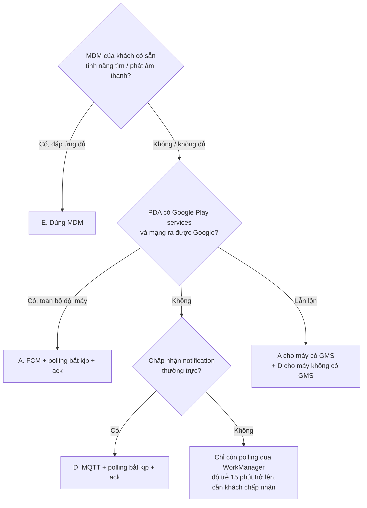

# PDA Finder: phân tích các phương án nhận lệnh tìm PDA

> Tài liệu để khách hàng chọn cơ chế gửi lệnh "tìm PDA" từ server xuống thiết bị.
> Người đọc: IT / dev. Trạng thái: **chờ khách hàng chốt**. Cập nhật: 2026-09-28.
>
> Tài liệu liên quan: [Requirements](PDA_FINDER_ALERT_REQUIREMENTS.md) · [Android fix tracker](ANDROID_FIX_TRACKER.md)

---

## 1. Tóm tắt

Có 4 phương án tự làm và 1 phương án dùng sẵn:

| # | Phương án | Một câu mô tả |
|---|---|---|
| A | **FCM** (Firebase Cloud Messaging) | Server nhờ Google đẩy lệnh xuống. Code hiện tại đang dùng cách này. |
| B | **Polling API** | PDA định kỳ hỏi server "có lệnh nào cho tôi không?" |
| C | **WebSocket** | PDA giữ một kết nối lâu dài tới server, server đẩy lệnh qua kết nối đó. |
| D | **MQTT** | Giống C nhưng dùng giao thức và broker chuyên cho thiết bị IoT/di động. |
| E | **Tính năng sẵn có của MDM** | Dùng chức năng tìm/phát âm thanh của phần mềm quản lý thiết bị khách đang dùng (nếu có). |

**Yếu tố quyết định lớn nhất là PDA có Google Play services (GMS) và mạng cửa hàng có đi ra được máy chủ Google hay không.**

- Nếu **có**: khuyến nghị **A (FCM) + polling "bắt kịp"**. Chi phí thấp nhất, gần như không tốn pin, và code đã có sẵn phần lớn.
- Nếu **không**: khuyến nghị **D (MQTT) chạy trong foreground service + polling "bắt kịp"**.
- Nếu **đội thiết bị lẫn lộn** (có máy GMS, có máy không): chạy song song A và D. Hai kênh dùng chung một bộ xử lý alert, chống trùng theo `requestId`.

Bất kể chọn phương án nào, cần làm thêm các **phần chung** ở mục 4: đăng ký thiết bị, API xác nhận (ack), hạn hiệu lực của lệnh, và lịch sử.

---

## 2. Đặc thù của bài toán tìm PDA

Người dùng chỉ đi tìm PDA khi nó **bị bỏ quên**: màn hình tắt, nằm yên một chỗ, pin đang cạn dần. Đây chính là điều kiện Android đưa máy vào **Doze** (chế độ tiết kiệm pin sâu):

- Mạng của app bị tạm ngắt. Hệ thống chỉ mở mạng trong các "cửa sổ bảo trì" ngắn, và các cửa sổ này thưa dần theo thời gian.
- CPU ngủ, nên các timer trong app (`Handler`, `ScheduledExecutor`) không chạy đúng giờ.
- Báo thức hẹn giờ chính xác (`AlarmManager.setExactAndAllowWhileIdle`) bị giới hạn **khoảng 1 lần mỗi 9 phút** cho mỗi app.
- Ngoài Doze của Android, hãng máy (Zebra, Honeywell, Urovo…) thường có thêm cơ chế quản lý pin riêng, có thể kill app chạy nền.

Vì vậy, khi so sánh các phương án, tiêu chí quan trọng nhất không phải lúc PDA đang cầm trên tay, mà là **PDA đã nằm im trong ngăn kéo 30 phút**.

---

## 3. Chi tiết từng phương án

### Phương án A: FCM

**Luồng xử lý**

```
Web quản lý → Backend ──(FCM HTTP v1 API)──► Google FCM ──► Google Play services trên PDA
                                                                   │ đánh thức app
                                                                   ▼
                                         MyFirebaseMessagingService.onMessageReceived()
                                                                   │
                                                                   ▼
                                         PdaAlertService (foreground service: chuông + popup)
                                                                   │
                                                                   ▼
                                         POST /api/pda/alerts/{requestId}/ack  (đã nhận / đã tắt)
```

**Phía Android**

| Thành phần | Chi tiết |
|---|---|
| Nhận lệnh | `FirebaseMessagingService`, chỉ dùng **data message** (không dùng notification message) |
| Đăng ký | Gọi `FirebaseMessaging.getInstance().getToken()` sau khi login và trong `onNewToken`; gửi token lên backend; retry bằng WorkManager khi offline |
| Phát alert | Foreground service ngắn hạn, chỉ chạy trong lúc chuông kêu (`foregroundServiceType="specialUse"`) |
| Quyền | `POST_NOTIFICATIONS` (Android 13+), `USE_FULL_SCREEN_INTENT`, `FOREGROUND_SERVICE_SPECIAL_USE` |
| Hiện trạng code | Đã có. Còn các bug trong tracker: A1, A2, A3, T1… |

**Phía backend**

- Tạo Firebase project **thuộc sở hữu của khách hàng**, dùng service account để gọi FCM HTTP v1 API.
- Lưu token theo thiết bị (bảng `device`, xem mục 4.1). Khi FCM trả về lỗi `UNREGISTERED`, xóa token đó.
- Mỗi message gửi với `android.priority = HIGH` và `ttl` bằng thời hạn hiệu lực của lệnh (ví dụ 120 giây).

Payload mẫu:

```json
{
  "message": {
    "token": "<fcm-token>",
    "android": { "priority": "HIGH", "ttl": "120s" },
    "data": {
      "type": "PDA_FINDER_ALERT",
      "requestId": "REQ-20260928-001",
      "storeCode": "STORE01",
      "message": "PDA đang được tìm kiếm bởi quản lý",
      "expiresAt": "2026-09-28T09:02:00Z"
    }
  }
}
```

**Ưu điểm**
- Là phương án duy nhất trong 4 cách tự làm **nhận được lệnh khi app bị kill và máy đang Doze** mà gần như không tốn thêm pin. Máy chỉ giữ một kết nối chung với Google cho mọi app.
- Message high priority được thiết kế để giao ngay cả khi máy đang Doze. Trên Android 12+, đây cũng là một trong số ít trường hợp app được phép khởi động foreground service từ background.
- FCM miễn phí. Backend đơn giản, không phải giữ kết nối với từng thiết bị.
- Code Android đã có sẵn phần lớn.

**Nhược điểm và rủi ro**
- **Bắt buộc PDA có Google Play services.** Nhiều PDA bản "non-GMS" hoặc bản cho thị trường Trung Quốc không có.
- **Mạng phải đi ra được máy chủ FCM** (`mtalk.google.com`, chủ yếu cổng 5228–5230, đôi khi 443). Mạng cửa hàng khóa chặt có thể chặn.
- User **force-stop** app (trên một số hãng, thao tác "Xóa tất cả" trong recents cũng là force-stop) thì app không nhận message nữa cho tới khi được mở lại.
- FCM không cam kết thời gian giao. Thường là vài giây, nhưng không có SLA.
- Nếu app nhận message high priority mà không hiện notification, FCM có thể tự hạ priority các message sau. Code hiện tại luôn hiện notification nên không bị.
- Message đi qua hạ tầng của Google. Cần khách hàng chấp nhận về mặt chính sách dữ liệu (payload chỉ có mã lệnh, không có dữ liệu nhạy cảm).
- FCM không hoạt động ở Trung Quốc đại lục.

**Ước lượng công sức** (xem ghi chú ở mục 6): Android 3–5 ngày (sửa nốt bug, vòng đời token) · Backend 2–3 ngày.

---

### Phương án B: Polling API

PDA định kỳ gọi `GET /api/pda/alerts/pending?deviceId=...`. Có 3 cách chạy polling, khác nhau rất nhiều:

| Cách | Độ trễ | Pin | Đánh giá |
|---|---|---|---|
| **B1. WorkManager** định kỳ | Tối thiểu **15 phút**, khi Doze còn lâu hơn | Thấp | ❌ Quá chậm để làm kênh chính |
| **B2. Foreground service + timer** (poll mỗi 30–60 giây) | 30–60 giây khi máy thức. **Khi Doze, timer bị trễ nhiều phút** | Trung bình | ⚠️ Chạy tốt lúc đang dùng máy, kém lúc máy bị bỏ quên |
| **B3. Foreground service + giữ wake lock liên tục** | Đúng chu kỳ | **Rất cao** | ❌ PDA bị bỏ quên sẽ hết pin nhanh, không tìm được nữa |

**Phía Android (cách B2)**
- Foreground service chạy suốt, có notification thường trực (bắt buộc với foreground service, user sẽ thấy).
- Loại foreground service: `specialUse`. Không dùng `dataSync`, vì từ Android 15 loại này bị giới hạn **6 giờ mỗi ngày**.
- Service phải được khởi động khi app đang mở, hoặc từ `BOOT_COMPLETED` (cần quyền `RECEIVE_BOOT_COMPLETED`). Android 12+ cấm khởi động foreground service từ background trong đa số trường hợp khác.
- Nhận callback khi có mạng lại (`ConnectivityManager.NetworkCallback`) để poll ngay lập tức.
- Cần whitelist app khỏi battery optimization, nếu không hãng máy sẽ kill service.

**Phía backend**
- Bảng lệnh chờ (`pda_alert`, xem mục 4.2), endpoint trả các lệnh chưa ack và chưa hết hạn.
- Tải lên server = số thiết bị ÷ chu kỳ poll. Ví dụ 1.000 PDA poll mỗi 30 giây là khoảng 33 request/giây liên tục, hầu hết trả về rỗng.

**Ưu điểm**
- Đơn giản nhất, không phụ thuộc Google, không cần giữ kết nối. Proxy và firewall không gây trở ngại vì chỉ là HTTPS thường.
- Mất mạng rồi có lại thì tự nhận được lệnh ở lần poll sau.

**Nhược điểm**
- Độ trễ bằng chu kỳ poll, và **tệ nhất đúng lúc cần nhất** (máy bị bỏ quên, đang Doze).
- Phải đánh đổi giữa độ trễ và pin, không có điểm cân bằng tốt.
- Notification thường trực trên thanh trạng thái.

**Vai trò nên dùng:** làm **lớp "bắt kịp"** bổ sung cho các phương án khác, không làm kênh chính. Poll một lần khi mở app, khi có mạng lại, khi màn hình bật. Cách này gần như không tốn pin.

**Ước lượng công sức:** chỉ lớp "bắt kịp": Android 1–2 ngày · Backend 1–2 ngày. Làm kênh chính (B2): Android 4–6 ngày · Backend 2–3 ngày.

---

### Phương án C: WebSocket

**Luồng xử lý**

```
PDA (foreground service) ══ WebSocket (wss://…/ws/pda) ══► Backend (session registry: deviceId → session)
                                                                   ▲
Web quản lý ── gửi lệnh ───────────────────────────────────────────┘
Backend ── đẩy lệnh qua đúng session ──► PDA ── ack qua cùng kết nối ──► Backend
```

**Phía Android**
- Foreground service chạy suốt (giống B2: `specialUse`, notification thường trực, khởi động từ app hoặc `BOOT_COMPLETED`).
- Client: OkHttp `WebSocket` (project đã có OkHttp). Đặt `pingInterval` khoảng 30–60 giây để phát hiện kết nối chết.
- Tự kết nối lại khi rớt: exponential backoff, và kết nối lại ngay khi `NetworkCallback` báo có mạng.
- Xác thực thiết bị khi mở kết nối (token trong header). Đã nằm ngoài phạm vi review client.
- Vì service đã ở foreground sẵn, khi nhận lệnh thì phát chuông ngay trong service này. Không gặp vấn đề chặn khởi động foreground service từ background (bug A5).

**Phía backend**
- Spring WebSocket (raw WebSocket hoặc STOMP). Lưu registry `deviceId → session`.
- **Chạy nhiều instance** thì cần Redis pub/sub hoặc message broker để lệnh tới được instance đang giữ kết nối của PDA.
- Bảng lệnh chờ để gửi lại khi PDA kết nối lại (kết nối rớt là chuyện thường xuyên).
- Load balancer/proxy phải hỗ trợ WebSocket và đặt idle timeout dài hơn chu kỳ ping.
- **Gói hosting free (ví dụ Render free) không phù hợp:** server ngủ khi rảnh và restart làm rớt toàn bộ kết nối.

**Ưu điểm**
- Độ trễ dưới 1 giây khi đang kết nối. Kênh 2 chiều nên ack có sẵn.
- Không phụ thuộc Google. Chạy qua cổng 443 nên ít bị firewall chặn.
- Biết thiết bị nào đang online (thiết bị nào đang có kết nối mở).

**Nhược điểm và rủi ro**
- **Giữ kết nối trên di động rất khó làm đúng:**
  - Wifi cửa hàng và NAT thường cắt kết nối im lặng sau vài phút.
  - Khi CPU ngủ, timer gửi ping có thể không chạy đúng giờ, nên kết nối đã chết mà app không biết.
  - Tiến trình có foreground service vẫn được dùng mạng khi Doze, nhưng hành vi khi CPU ngủ khác nhau tùy máy. **Bắt buộc test trên đúng model PDA.**
- Backend phức tạp nhất: quản lý hàng nghìn kết nối, scale, gửi lại lệnh.
- Tốn pin hơn FCM (mỗi app tự giữ một kết nối riêng), và có notification thường trực.
- Phải tự làm những thứ MQTT có sẵn: đảm bảo giao, giữ message khi offline, trạng thái online.

**Ước lượng công sức:** Android 6–9 ngày · Backend 6–10 ngày (chưa tính hạ tầng scale).

---

### Phương án D: MQTT

Cũng là kết nối lâu dài như C, nhưng dùng **MQTT**, giao thức sinh ra cho thiết bị kết nối qua mạng chập chờn. Cần thêm một **broker** (máy chủ trung gian).

**Luồng xử lý**

```
PDA (foreground service, MQTT client) ══ subscribe: pda/{storeCode}/{deviceId}/cmd ══► MQTT Broker
Backend ── publish lệnh (QoS 1) ──► Broker ── giao cho PDA (giữ lại nếu PDA đang offline)
PDA ── publish ack ──► pda/{storeCode}/{deviceId}/ack ──► Backend (subscribe)
Broker ── Last Will khi PDA mất kết nối ──► pda/{storeCode}/{deviceId}/status = offline
```

**Những gì MQTT có sẵn mà WebSocket phải tự làm**

| Tính năng | Ý nghĩa với bài toán |
|---|---|
| **QoS 1** | Đảm bảo lệnh được giao ít nhất một lần. App chống trùng theo `requestId` |
| **Persistent session** (`cleanSession=false`) | Broker giữ lệnh khi PDA offline và giao khi PDA kết nối lại |
| **Keepalive** tích hợp | Broker và client tự phát hiện kết nối chết |
| **Last Will (LWT)** | Broker tự báo khi PDA mất kết nối, nên có sẵn **trạng thái online/offline** của từng máy |

**Phía Android**
- Foreground service chạy suốt (giống B2/C).
- Client: HiveMQ MQTT Client (Java, còn được bảo trì) hoặc Eclipse Paho Java client. **Không dùng** Paho Android Service vì đã ngừng phát triển và lỗi trên Android mới.
- Keepalive 60–300 giây. Chọn giá trị ngắn hơn NAT timeout của mạng cửa hàng; cần đo thực tế.
- Xác thực theo từng thiết bị: username/password riêng hoặc TLS client certificate.

**Phía backend / hạ tầng**
- Broker: tự host (Mosquitto, EMQX) hoặc dịch vụ managed (HiveMQ Cloud, EMQX Cloud, AWS IoT Core…).
- Backend Spring gửi lệnh qua MQTT client (ví dụ Spring Integration MQTT).
- Cổng mặc định là 1883/8883. **Mạng cửa hàng có thể chặn các cổng này.** Khi đó dùng MQTT over WebSocket qua cổng 443.

**Ưu điểm**
- Không phụ thuộc Google. Độ trễ dưới 1 giây khi đang kết nối.
- Tin cậy hơn tự làm WebSocket: đảm bảo giao, giữ lệnh khi offline, có trạng thái online, tất cả đều có sẵn.
- Backend đơn giản hơn C: broker lo phần giữ kết nối và scale, backend chỉ publish/subscribe.
- Mở rộng được cho các lệnh khác sau này (khóa máy, đồng bộ dữ liệu…).

**Nhược điểm và rủi ro**
- Thêm một thành phần hạ tầng (broker) phải vận hành, giám sát, hoặc trả phí.
- Vẫn có các vấn đề chung của kết nối lâu dài: foreground service thường trực, pin, Doze, hãng máy kill app. Vẫn **bắt buộc test trên đúng model PDA**.
- Team cần làm quen MQTT.

**Ước lượng công sức:** Android 5–7 ngày · Backend 3–5 ngày · Dựng broker 2–3 ngày (managed thì ít hơn).

---

### Phương án E: Tính năng sẵn có của MDM

Nhiều doanh nghiệp đã quản lý PDA bằng MDM (SOTI MobiControl, Microsoft Intune, VMware Workspace ONE, các công cụ của Zebra…). Một số MDM có sẵn tính năng **tìm thiết bị / phát âm thanh từ xa**. Tính năng cụ thể tùy sản phẩm, cần kiểm tra với MDM khách đang dùng.

- **Ưu điểm:** không phải phát triển. MDM agent thường có quyền hệ thống nên không bị hãng máy kill.
- **Nhược điểm:** phụ thuộc bản quyền và cấu hình MDM. Khó tích hợp vào quy trình của app (ai tìm, request nào, lịch sử). Có thể không tùy biến được âm thanh hay nội dung popup.
- **Nên hỏi trước tiên:** nếu MDM đáp ứng đủ, có thể không cần làm tính năng này.

---

## 4. Phần chung, phương án nào cũng cần

### 4.1 Đăng ký thiết bị

```
device(
  device_id      -- định danh ổn định của PDA (xem ghi chú)
  store_code
  user_id        -- người đang đăng nhập (nếu có)
  channel        -- FCM | MQTT | WS | POLL
  push_token     -- FCM token (chỉ phương án A)
  app_version
  last_seen_at   -- lần cuối PDA liên lạc với server
  updated_at
)
```

**Ghi chú về `device_id`:**
- `Settings.Secure.ANDROID_ID` đổi khi factory reset, và từ Android 8 còn khác nhau theo khóa ký app.
- Số serial phần cứng thì Android 10+ không cho app thường đọc; trên Zebra phải qua OEMInfo, trên các hãng khác qua MDM.
- Tốt nhất là lấy mã tài sản từ MDM, hoặc cấu hình mã này khi triển khai máy.

### 4.2 Vòng đời lệnh tìm

```
pda_alert(
  request_id   -- khóa chống trùng, dùng chung mọi kênh
  device_id
  requested_by
  message
  created_at
  expires_at   -- PDA bỏ qua lệnh đã hết hạn (tránh kêu cho lệnh cũ khi online lại)
  status       -- SENT → DELIVERED → STOPPED_BY_USER | TIMED_OUT | EXPIRED
  delivered_at
  stopped_at
)
```

API tối thiểu:

| Endpoint | Mục đích |
|---|---|
| `POST /api/devices` | PDA đăng ký hoặc cập nhật thông tin (token, version) |
| `POST /api/pda/{deviceId}/alerts` | Web quản lý tạo lệnh tìm |
| `GET /api/pda/alerts/pending` | Polling "bắt kịp" |
| `POST /api/pda/alerts/{requestId}/ack` | PDA báo `DELIVERED` / `STOPPED_BY_USER` / `TIMED_OUT` |

Ack cho phép màn hình quản lý hiển thị "PDA đã nhận lệnh" hoặc "chưa liên lạc được". Nó cũng trả lời Open Question #6 trong requirements (lịch sử tìm kiếm).

### 4.3 Kiến trúc phía Android

Tách **nguồn nhận lệnh** khỏi **bộ phát alert**:

```
FCM service ─┐
MQTT client ─┼──► AlertDispatcher.onCommand(requestId, message, expiresAt)
Poller ──────┘        │  - bỏ qua nếu hết hạn
                      │  - bỏ qua nếu requestId đã xử lý (chống trùng giữa các kênh)
                      ▼
                PdaAlertService (chuông, volume, popup, timeout, ack)
```

Nhờ đó có thể bật nhiều kênh cùng lúc, hoặc đổi kênh sau này mà không phải sửa phần alert.

### 4.4 Việc triển khai trên thiết bị

- **Whitelist battery optimization** cho app. Nên làm qua MDM; không có MDM thì phải hướng dẫn user.
- Cấp quyền notification và full-screen intent (Android 13/14+).
- Cấu hình để app không bị force-stop khi user dọn recents (tùy hãng).

---

## 5. Bảng so sánh theo tình huống

✅ nhận được ngay · ⚠️ trễ hoặc tùy máy · ❌ không nhận được

| Tình huống | A. FCM | B2. Polling (FGS) | C. WebSocket | D. MQTT |
|---|---|---|---|---|
| Đang dùng máy, app mở | ✅ | ⚠️ trễ bằng chu kỳ poll | ✅ | ✅ |
| App ở background, màn hình tắt | ✅ | ⚠️ | ✅ | ✅ |
| Máy bị bỏ quên, Doze sâu | ✅ | ⚠️ trễ nhiều phút | ⚠️ tùy máy, phải test | ⚠️ tùy máy, phải test |
| App bị hệ thống/hãng kill | ✅ (trừ khi hãng kill kiểu force-stop) | ❌ tới khi service chạy lại | ❌ tới khi service chạy lại | ❌ tới khi service chạy lại |
| User force-stop app | ❌ | ❌ | ❌ | ❌ |
| Khởi động lại máy | ✅ | ✅ nếu có `BOOT_COMPLETED` | ✅ nếu có `BOOT_COMPLETED` | ✅ nếu có `BOOT_COMPLETED` |
| Mất mạng rồi có lại (trong thời hạn lệnh) | ✅ FCM giữ theo TTL | ✅ | ⚠️ server phải tự gửi lại | ✅ broker giữ lệnh |
| PDA không có Google Play services | ❌ | ✅ | ✅ | ✅ |
| Mạng chặn Google | ❌ | ✅ | ✅ | ✅ (dùng cổng 443 nếu bị chặn 1883/8883) |
| Biết PDA đang online | ❌ | ⚠️ qua `last_seen_at` | ✅ | ✅ (Last Will) |

| Chi phí / đặc tính | A. FCM | B2. Polling | C. WebSocket | D. MQTT |
|---|---|---|---|---|
| Pin | Rất thấp | Trung bình – cao | Trung bình | Trung bình |
| Notification thường trực | Không | Có | Có | Có |
| Hạ tầng thêm | Firebase project (miễn phí) | Không | Hỗ trợ WebSocket, Redis khi scale | Broker MQTT |
| Công sức (Android + Backend) | Thấp | Trung bình | Cao | Trung bình – cao |

---

## 6. Ghi chú về ước lượng công sức

Các con số ngày công ở trên là **ước lượng thô để so sánh tương đối giữa các phương án**, không phải báo giá. Giả định: 1 dev đã quen stack, chưa tính QA, test trên thiết bị và vận hành. Sau khi khách chốt model PDA và hạ tầng, cần ước lượng lại chi tiết.

---

## 7. Khách hàng cần trả lời để chốt

| # | Câu hỏi | Ảnh hưởng |
|---|---|---|
| 1 | Model PDA và phiên bản Android? **Có Google Play services không?** | Không có GMS thì loại phương án A |
| 2 | Mạng cửa hàng có đi ra được máy chủ Google (`mtalk.google.com`, cổng 5228–5230) không? Có chặn cổng 1883/8883 không? | Loại A, hoặc buộc D chạy qua cổng 443 |
| 3 | Có đang dùng MDM không? MDM đó có tính năng tìm/phát âm thanh từ xa không? | Có thể chọn E, không cần phát triển. Ảnh hưởng cách whitelist pin và lấy `device_id` |
| 4 | Độ trễ chấp nhận được: vài giây hay vài phút? | Vài phút thì polling đơn giản có thể đủ |
| 5 | Có chấp nhận notification thường trực trên PDA không? | Không chấp nhận thì loại B2, C, D |
| 6 | Có chấp nhận lệnh đi qua hạ tầng Google (Firebase) không? | Chính sách dữ liệu có thể loại A |
| 7 | Quy mô: bao nhiêu PDA, bao nhiêu cửa hàng? Hạ tầng server hiện có (cloud nào, có Redis/broker chưa)? | Chi phí và độ phức tạp của C/D |
| 8 | Có cần biết PDA đang online/offline trên màn hình quản lý không? | Có thì D (hoặc C) có lợi thế |

## 8. Cây quyết định gợi ý


